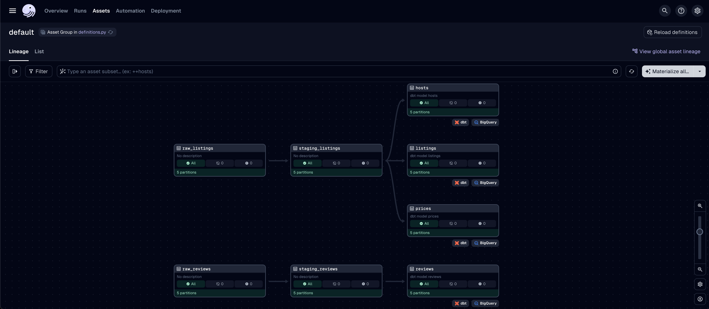
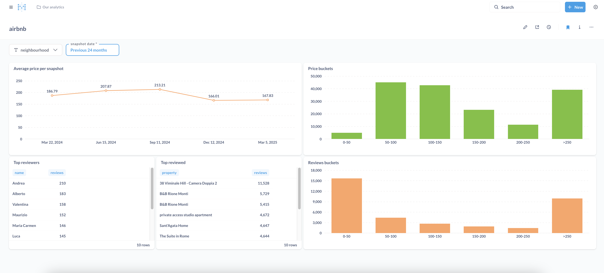

# Airbnb data pipeline
Project for [Data Engineering Zoomcamp 2025](https://github.com/DataTalksClub/data-engineering-zoomcamp).

Pipeline that ingests Airbnb data for Rome, processes it through a series of transformations, and makes it available for analysis and visualization. It does:
- orchestration with Dagster
- ingestion on Google Cloud Storage with Polars and Python
- data warehousing in BigQuery
- transformation with dbt
- dashboard visualization with Metabase

<p float="left">
    
    
</p>

### Data Ingestion

The pipeline ingests Airbnb listings and reviews data quarterly using Dagster for orchestration:

The data is downloaded from [InsideAirbnb](https://insideairbnb.com/) and stored in Google Cloud Storage as Parquet files using Polars.

### Data Warehouse & Transformations

The data pipeline uses BigQuery as data warehouse.

It creates external tables from Parquet files stored in GCS and merges them into BigQuery staging tables (`staging_listings` and `staging_reviews`).

The pipeline then uses dbt to transform the staging data into the following analytics-ready tables, applying data type conversions (for example string price to numeric) and business logic for deduplication:
   - listings
   - prices
   - reviews
   - hosts


To ensure efficient queries, tables are configured with time-based partitioning (`prices` and `reviews`, by `snapshot_date`) and clustering (`listings`, by `neighbourhood`) through configurations of dbt models like the following.

```sql
{{ 
    config(
        materialized='incremental',
        unique_key=['id', 'snapshot_date'],
        partition_by={
            "field": "snapshot_date",
            "data_type": "date",
            "granularity": "month"
        })
}}
```

```sql
{{ 
    config(
        materialized='table',
        cluster_by='neighbourhood'
    )
}}

```

### Dashboard
Metabase is configured to connect to BigQuery and provides a dashboard for prices and reviews.

## Running the project

1. Edit the `.env` file adding:
- `</path/to/your/credentials.json>`
- `<your-gcp-project-id>`
- `<your-gcs-bucket-name>`

1. Run
- `terraform -chdir=terraform init`
- `terraform -chdir=terraform apply --var="credentials=</path/to/your/credentials.json>" --var="project=<your-gcp-project-id>" --var="gcs_bucket_name=<your-gcs-bucket-name>"` 

1. Run `docker compose --env-file .env up`

1. Access the Dagster interface at `http://localhost:3000`

1. Materialize all the Dagster assets (click "Materialize all...", select all partition and click "Launch backfill")

1. Access the Metabase dashboard at `http://localhost:12345` with credentials user@example.org / admin001

1. Go to Settings > Admin settings > Databases > airbnb and set your "Project id" and "Service account JSON file"
